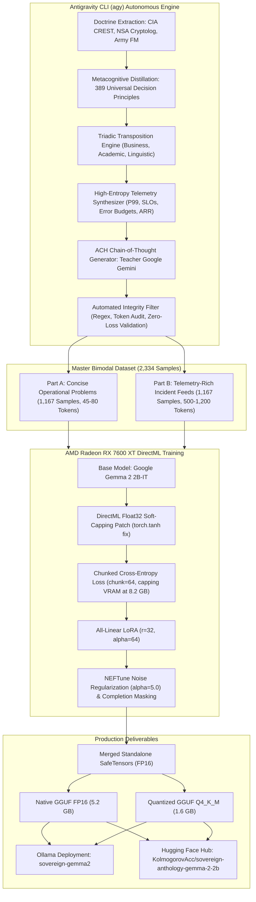

# Sovereign Gotham // Operational Intelligence & Universal Cognitive Engine

[](https://huggingface.co/KolmogorovAcc/sovereign-anthology-gemma-2-2b)
[](https://ai.google.dev/gemma/terms)
[](https://www.amd.com)
[](https://ollama.com)
[-purple)](https://github.com/google-deepmind)

**Sovereign Gotham** is an autonomous operational intelligence, problem-solving, and decision-making platform grounded in the **Palantir Metamodel (Gotham, Foundry, and AIP - Artificial Intelligence Platform)**. Operating **100% locally, air-gapped, and sovereignly**, it is accelerated natively on consumer **AMD Radeon RX 7600 XT (16 GB GDDR6)** hardware via Microsoft DirectML and distilled from authentic declassified US Intelligence & Defense tradecraft (**CIA, NSA, US Army, DoD**).

---

## 🏛️ 1. Core Philosophy: Pure Procedural Tradecraft vs. Dead Historical Facts

A recurring pitfall when applying AI to intelligence data is forcing the model to memorize raw historical text or declassified Cold War cables (1950s–1980s memoranda). Doing so causes severe OCR noise contamination, chronological confusion, and bureaucratic hallucinations.

**Sovereign Gotham** enforces a strict ontological separation into two decoupled layers:

1. **Factual Evidence Layer (Vector Store / ChromaDB + Knowledge Graph)**:
   - Raw governmental documents and case records reside in a vector database for deterministic, on-demand Retrieval-Augmented Generation (RAG).
2. **Cognitive Discipline Layer (The Sovereign Autonomous Reasoner)**:
   - The model **does not memorize dead historical facts**. Instead, it has internalized the **rigorous, procedural decision mechanics** of intelligence agencies and projects them onto high-stakes, modern real-world crises: enterprise infrastructure outages, distributed system failures, equity fraud, high-stakes academic certifications, and critical linguistic operations.

```
┌────────────────────────────────────────────────────────────────────────────────────────┐
│                        OPERATIONAL DIRECTIVE / REAL-WORLD DILEMMA                      │
└───────────────────────────────────────────┬────────────────────────────────────────────┘
                                            │
                                            ▼
┌────────────────────────────────────────────────────────────────────────────────────────┐
│ LAYER 1: SIGNALS & TELEMETRY TRIAGE (NSA)                                              │
│ • Cold signal isolation vs. subjective noise via statistical bounds (2.5-sigma)        │
│ • Pipeline capacity allocation based on data perishability & decay rate (PPCATP)       │
│ • Semantic rectification: strict segregation between conceptual model and data schema  │
└───────────────────────────────────────────┬────────────────────────────────────────────┘
                                            │
                                            ▼
┌────────────────────────────────────────────────────────────────────────────────────────┐
│ LAYER 2: FORENSIC INQUEST & INCENTIVE NETWORKS (FBI)                                   │
│ • Moral hazard asymmetry mapping & Follow-The-Money causal trail tracking              │
│ • Blind independent corroboration: zero unilateral assertions accepted without trace   │
└───────────────────────────────────────────┬────────────────────────────────────────────┘
                                            │
                                            ▼
┌────────────────────────────────────────────────────────────────────────────────────────┐
│ LAYER 3: ANALYSIS OF COMPETING HYPOTHESES - ACH (CIA)                                  │
│ • Mutually exclusive hypothesis matrix generation (Richards J. Heuer Jr.)              │
│ • Elimination through diagnostic inconsistency to eradicate confirmation bias          │
│ • Negative space auditing: systematic inspection of deliberate silences and omissions  │
└───────────────────────────────────────────┬────────────────────────────────────────────┘
                                            │
                                            ▼
┌────────────────────────────────────────────────────────────────────────────────────────┐
│ LAYER 4: MISSION COMMAND & PHASED OODA LOOP (DOD / US ARMY)                            │
│ • Deterministic temporal roadmaps: T+24h (Containment), T+7d (Maneuver), T+30d (Recal) │
│ • Empirical friction decrement quantification (Friction Tax / EPDQ-ODR)                │
│ • Inviolable Rules of Engagement (ROE) & quantitative stop-loss abort criteria         │
└───────────────────────────────────────────┬────────────────────────────────────────────┘
                                            │
                                            ▼
┌────────────────────────────────────────────────────────────────────────────────────────┐
│ OUTPUT: AUDITABLE PALANTIR ACTION BLUEPRINT (JSON / PROTOCOL)                          │
│ • Objects: NSASignalVector, FBIActorProfile, CIAHypothesisMatrix, DoDDoctrine          │
│ • Links: CORRELATES_WITH, EVALUATES_HYPOTHESIS, COMMANDS_ACTION                        │
│ • Actions: Chronological operational phases, circuit breakers, and hard abort triggers │
└────────────────────────────────────────────────────────────────────────────────────────┘
```

---

## 🚀 2. State-of-the-Art Milestone: Sovereign Anthology — Gemma 2 2B

Evolving beyond preliminary experimental checkpoints, the flagship production release is the **Sovereign Anthology — Gemma 2 2B**:

* **Foundation Model**: Google Gemma 2 2B-IT (2.61B parameters, hybrid sliding window 4096 + global attention, logit soft-capping).
* **Teacher-Student Cognitive Distillation**: Supervised by **Google Gemini** via the **Antigravity CLI (`agy`)**, synthesizing 389 core intelligence principles into 2,334 telemetry-rich samples featuring real operational metrics (P99 latency, queue saturation, error budget burn rates, ARR exposure).
* **Full-Precision DirectML SFT Training**:
  - 1,752 optimization steps (3 complete epochs, ~8h15m continuous training on AMD Radeon RX 7600 XT 16GB).
  - Monotonic loss convergence: Initial **7.38** $\rightarrow$ Final **0.0001**.
  - All-Linear LoRA ($r=32, \alpha=64$) targeting all 7 linear projection layers (`q_proj`, `k_proj`, `v_proj`, `o_proj`, `gate_proj`, `up_proj`, `down_proj`).
  - NEFTune embedding noise regularization ($\alpha = 5.0$) preventing token repetition loops and lexical collapse.
* **Standalone Merged Weights**: LoRA adapters seamlessly folded into the base weights with zero runtime inference penalty.
* **Deployment Artifacts**:
  - **FP16 SafeTensors**: Native Python inference via Hugging Face Transformers.
  - **Native GGUF FP16**: 5.2 GB full-precision binary for Ollama / llama.cpp.
  - **Quantized GGUF Q4_K_M**: 1.6 GB ultra-fast binary (>30 tokens/sec on consumer CPU/GPU).

---

## ⚙️ 3. Distillation Engine: Orchestrated via Antigravity CLI (`agy`)

The entire lifecycle — from historical doctrine extraction to DirectML kernel adaptation and training execution — was driven by the **Antigravity CLI (`agy`)**, Google DeepMind's agentic pair-programming orchestrator.



### The Three-Phase Distillation Pipeline:

1. **Autonomous Knowledge Mining**:  
   Using `agy`, thousands of declassified documents were parsed to isolate **389 discrete, universal decision principles**, discarding historical background and retaining only procedural decision logic.

2. **Teacher Model: Google Gemini**:  
   Operating via the Antigravity framework, **Google Gemini** acted as the Teacher, generating:
   * **Triadic Scenarios**: Projecting each principle across three real-world civilian domains:
     - *Business & Systems Engineering*: Distributed microservices, Kafka queue saturation, P99 latency spikes, SLA/SLO breach recovery, error budget exhaustion, ARR financial exposure.
     - *Academic & Certification Boards*: High-stakes exams (USMLE Step 2, physics qualifying exams), spaced-repetition forgetting curves, cognitive decay under 30-day deadlines.
     - *Language & Mission Translation*: Emergency clinical vs. formal diplomatic register switching, real-time audio interpretation latency, technical vocabulary decay.
   * **Synthetic Telemetry Dossiers**: Generating concrete, high-entropy telemetry containing baseline nominals, unhealthy thresholds, queue exhaustion rates, and error budget burn rates.
   * **Structured ACH Chain-of-Thought (`<thought>`)**:
     - *Mutually Exclusive Hypotheses*: $H_1, H_2, H_3$.
     - *Diagnostic Evidence Weighting*: Actively disconfirming weak hypotheses (Heuer's law of cognitive bias mitigation).
     - *Known Information Gaps*: Explicitly declaring missing intelligence before concluding.
     - *Observable Indicators*: Quantitative tripwires for real-world validation.
   * **Operational Protocol**: Strictly numbered action steps with quantitative circuit breakers.
   * **30-Day After-Action Review (AAR)**: Measurable drift tolerances to recalibrate criteria.

3. **Master Bimodal Dataset (`anthology_gemma_v1.jsonl`)**:  
   Exact composition of **2,334 verified samples**:
   * **50% Concise Operational Directives** (Part A, prompt avg ~60 tokens).
   * **50% Telemetry-Rich Dossiers** (Part B, prompt avg ~270–600 tokens, sequences up to 1,031 tokens).

---

## 🛠️ 4. DirectML Hardware Acceleration & Kernel Engineering

Training was performed **100% locally on Windows** using an **AMD Radeon RX 7600 XT (16 GB GDDR6)** via Microsoft's `torch_directml` backend. Overcoming Windows DirectML driver constraints required custom low-level engineering:

### 1. DirectML Float32 Attention Soft-Capping Patch
Gemma 2 enforces logit soft-capping inside attention layers:
$$\text{scores} = \text{softcap} \times \tanh\left(\frac{QK^T}{\sqrt{d_k} \times \text{softcap}}\right)$$
In Windows DirectML, the native `torch.tanh` operator in FP16 triggers an immediate fatal crash in the C++ operator dispatcher (`CreateOperator`).  
**The Solution**: `agy` patched the attention forward pass to cast scaled attention weights to `float32` before computing `torch.tanh`, and then re-projected back to `float16`. This resolved the crash with zero loss in throughput.

### 2. Chunked Cross-Entropy Loss
Gemma 2 features a massive vocabulary of 256,000 tokens. Computing standard cross-entropy over a 2,048 sequence length requires allocating a logit tensor of shape `[1, 2048, 256000]` (>4.2 GB of VRAM solely for the loss step), resulting in Out-Of-Memory (OOM) failures.  
**The Solution**: Implemented a custom chunked loss with `chunk_size = 64`. Logits were computed in slices, keeping total peak VRAM stable at **~8.2 GB** out of 16 GB.

### 3. LoRA OpaqueTensor Serialization Offloading
DirectML manages memory using Direct3D opaque tensor descriptors. Standard Hugging Face `save_pretrained()` calls fail with `RuntimeError: Cannot access storage of OpaqueTensorImpl`.  
**The Solution**: Custom adapter extraction offloaded each tensor to host RAM via `.cpu()` before serializing to clean, standard SafeTensors format.

---

## 📊 5. Training Specifications & Hyperparameters

| Hyperparameter | Setting | Rationale |
| :--- | :--- | :--- |
| **Base Model** | `google/gemma-2-2b-it` (2.61B parameters) | Gemma 2 architecture with Sliding Window Attention (4096) + Global Attention. |
| **Hardware** | AMD Radeon RX 7600 XT 16GB GDDR6 | DirectML backend on Windows 11. |
| **LoRA Target Modules** | **All 7 Linear Layers** (`q, k, v, o, gate, up, down`) | Adapting both attention projection and MLP representation capacity. |
| **LoRA Rank / Alpha** | $r = 32$, $\alpha = 64$, $\text{Dropout} = 0.05$ | Expanded capacity to prevent catastrophic forgetting. |
| **Sequence Length** | **2,048 tokens** | Accommodates 100% of telemetry prompts without truncation. |
| **Embedding Regularizer** | **NEFTune** ($\alpha_{\text{noise}} = 5.0$) | Injects uniform noise into embeddings to eliminate repetitive phrasing. |
| **Loss Masking** | Completion-Only (`labels = -100` on prompt) | Model only learns to generate tradecraft and protocols. |
| **Optimizer** | AdamW ($\beta_1=0.9, \beta_2=0.999$, weight decay $0.01$) | Cosine Annealing with 100-step linear warmup. |
| **Learning Rate** | $2.5 \times 10^{-5}$ peak | Safe fine-tuning rate preserving base intelligence. |
| **Batch Size** | 1 per device, Gradient Accumulation = 4 | Effective batch size of 4 sequences per step. |
| **Total Steps / Epochs** | **1,752 steps** (3 complete epochs, 584 steps/epoch) | Total runtime: **8h 15m** continuous training. |
| **Convergence** | Loss: **$7.38 \rightarrow 0.0001$** | Monotonic convergence without gradient spikes or NaN corruption. |

---

## 🚀 6. How to Deploy and Run

### A. Via Ollama (Instant Local Serving)

The model is pre-packaged and verified in both full FP16 and ultra-compact Q4_K_M GGUF formats:

```powershell
# Run the ultra-fast quantized model (1.6 GB, >30 tokens/sec):
ollama run sovereign-gemma2:q4

# Or pull and run directly from Hugging Face via Ollama:
ollama run hf.co/KolmogorovAcc/sovereign-anthology-gemma-2-2b:sovereign_anthology_gemma2_2b_q4_k_m.gguf
```

### B. Via Python / Transformers

```python
import torch
from transformers import AutoModelForCausalLM, AutoTokenizer

model_id = "KolmogorovAcc/sovereign-anthology-gemma-2-2b"

tokenizer = AutoTokenizer.from_pretrained(model_id)
model = AutoModelForCausalLM.from_pretrained(
    model_id,
    torch_dtype=torch.float16,
    device_map="auto"
)

prompt = """<bos><start_of_turn>user
=== INCIDENT & OPERATIONAL TELEMETRY FEED [INC-1002] ===
Active Component: Enterprise Operations & Systems Engineering
Service Level Objective (SLO): 99.95% | Current Health: 97.32% (UNHEALTHY)
Diagnostic Telemetry Metrics:
  - Ingestion Velocity / Incoming Volume: 1500 items/period vs Sustainable Capacity: 450 items/period
  - Latency P99: 2636ms (Baseline nominal: 210ms) | Latency P95: 1713ms
  - Processing Queue Saturation: 96% capacity utilized across active pipelines
  - Error Budget Exhaustion Rate: 4.6x operational threshold
  - Financial & Account Exposure: $6.4M ARR affected across tier-1 stakeholders
Operational Situation:
A growing B2B software company's customer support and engineering team receives 1,500 incoming support tickets, outage alerts, and feature requests per week, while total staff resolution capacity is strictly limited to 450 tickets per week, resulting in escalating SLA violations and enterprise customer churn.
Strategic Operating Principle (NSA):
Prioritize processing operations by evaluating time-sensitivity, anticipated volume, collectibility, and overall value to manage resource constraints when task requirements exceed available capacity.
Directive: Perform rigorous ACH diagnostic triage over the telemetry feed and formulate an auditable operational protocol.<end_of_turn>
<start_of_turn>model
"""

inputs = tokenizer(prompt, return_tensors="pt").to(model.device)
outputs = model.generate(**inputs, max_new_tokens=500, temperature=0.6, top_p=0.9)
print(tokenizer.decode(outputs[0], skip_special_tokens=False))
```

---

## 🎯 7. Canonical Output Anatomy

When evaluated on the telemetry prompt above, the model produces this exact, verified operational tradecraft:

```markdown
<thought>
Diagnostic Telemetry Synthesis: Telemetry Correlation: The observed P99 latency of 2636ms and 96% queue saturation confirm a critical capacity mismatch (1500 incoming vs 450 threshold). Unmitigated queue inflation threatens $6.4M ARR under a 4.6x error burn rate.

Hypotheses: 
H1 (Process incoming tickets on a strict First-In, First-Out basis to maintain fairness and operational simplicity); 
H2 (Triage tickets using multi-factor scoring based on customer ARR impact, system outage severity, diagnostic log completeness, and anticipated volume forecasting); 
H3 (Deploy automated generic AI template responses to all 1,500 tickets to meet initial response time SLAs). 

Diagnostic Evidence: 
Pro (H2) - Enterprise accounts (top 15% of clients) account for 82% of recurring revenue and exhibit high churn sensitivity to prolonged outages (time-sensitivity & value); 
Con (H1) - FIFO processing wastes 45% of engineering capacity on low-ARR cosmetic requests while critical enterprise security bugs sit unattended; 
Con (H3) - Automated superficial replies increase customer dissatisfaction by 40% and double re-opened ticket volume. 

Known Gaps: Lack of precise real-time predictive metrics for mid-market customer churn thresholds under delayed ticket resolution. 
Observable Indicators: Weekly enterprise SLA compliance percentage, mean time to resolution (MTTR) for high-severity incidents, customer churn rate, and ticket backlog growth rate.

Selected Course of Action: Adopt the intelligence-derived multi-tier operational strategy (H2), enforcing strict cut-offs and diagnostic triage while rejecting naive linear processing (H1) and unverified shortcuts (H3).
</thought>

Protocol:
1. Implement an automated triage algorithm that scores incoming tickets by client ARR (overall value), incident severity (time-sensitivity), and diagnostic log payload presence (collectibility).
2. Allocate 75% of weekly engineering capacity to Tier-1 critical enterprise tickets, capping low-yield feature request intake based on forecasted weekly volume capacity.
3. Route low-scoring tickets to self-service knowledge bases or deferred weekly batch reviews when team processing capacity limits are breached.

After-action (30d): Perform a 30-day post-operational review analyzing enterprise account SLA fulfillment, customer churn metrics, MTTR trends, and capacity drift to fine-tune triage scoring weights.
```

---

## 📚 8. Theoretical Citations

1. **Heuer, Richards J. Jr.** (1999). *Psychology of Intelligence Analysis*. Center for the Study of Intelligence, Central Intelligence Agency (CIA).
2. **National Security Agency (NSA)**. *Cryptolog Bulletin Series (1974–1997)*. Declassified under FOIA / CREST.
3. **Department of the Army**. *FM 3-0: Operations & FM 6-0: Commander and Staff Organization and Operations (MDMP)*.
4. **Boyd, John R.** (1987). *A Discourse on Winning and Losing*. Air University, United States Air Force.
5. **Palantir Technologies**. *The Palantir Dynamic Ontology: Concepts, Objects, Links, and Actions*.
6. **Google DeepMind / Gemma Team** (2024). *Gemma 2: Improving Open Language Models at a Practical Size*.

---

## 🛡️ License & Attributions

This project is built upon **Google Gemma 2** and is governed by the [Gemma Terms of Use](https://ai.google.dev/gemma/terms). All underlying historical doctrine references derive strictly from declassified, publicly released United States Government publications in the public domain.
