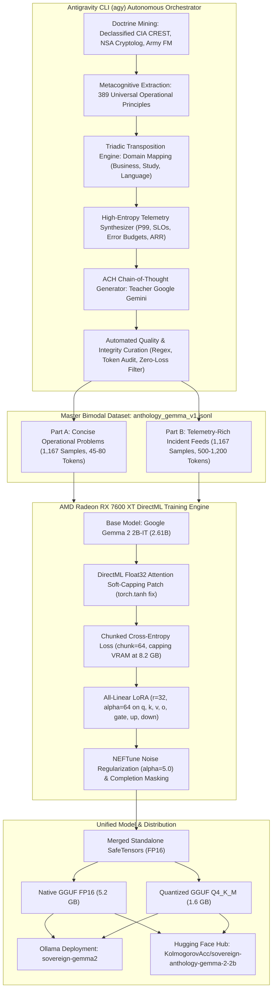

---
language:
- en
- pt
license: gemma
base_model: google/gemma-2-2b-it
pipeline_tag: text-generation
tags:
- intelligence
- tradecraft
- analysis-of-competing-hypotheses
- ach
- directml
- gemma-2
- palantir
- sovereign
- antigravity
- distillation
library_name: transformers
---

# SOVEREIGN ANTHOLOGY — Gemma 2 2B (Operational Tradecraft Model)

[](https://huggingface.co/KolmogorovAcc/sovereign-anthology-gemma-2-2b)
[](https://ai.google.dev/gemma/terms)
[](https://www.amd.com)
[](https://ollama.com)
[-purple)](https://github.com/google-deepmind)

> **Autonomous Sovereign Reasoning Model fine-tuned on Google Gemma 2 2B-IT using DirectML on AMD Radeon RX 7600 XT.**  
> Built through Teacher-Student Cognitive Distillation orchestrated via the **Antigravity CLI (`agy`)**, distilling operational decision tradecraft from declassified US intelligence doctrine (**CIA, NSA, US Army, DoD**) with **Google Gemini** as Teacher, and projecting it into high-stakes civilian, engineering, and enterprise domains.

---

## 🏛️ 1. Executive Summary & The Core Idea

Small Language Models (SLMs, 1B–3B parameters) are exceptionally efficient for on-device computing, but traditionally suffer from a catastrophic failure mode: **reasoning collapse and lexical degradation when subjected to long, noisy, telemetry-rich operational prompts**. When faced with large metric streams, competing hypotheses, or high-tempo trade-offs, standard SLMs either hallucinate generic platitudes, repeat tokens, or break down entirely.

The **Sovereign Anthology** project set out to prove that a 2.6B model can master **rigorous, multi-hypothesis decision tradecraft** if trained on *pure procedural methodology* rather than factual memorization:

1. **Rote Memorization is the Enemy of Transferable Intelligence**:  
   Rather than having the model memorize dead historical events, Cold War cables, or intelligence lore (which introduces OCR noise and bureaucratic hallucinations), the model was trained on the **pure procedural mechanics of decision-making under uncertainty**.
2. **Declassified Intelligence Doctrine as the Ultimate Decision Framework**:  
   Over decades of high-stakes operations, intelligence agencies developed formal analytic methods specifically designed to counter cognitive bias, incomplete data, and deceptive noise:
   * **CIA (Richards J. Heuer Jr.)**: *Analysis of Competing Hypotheses (ACH)* — formulating mutually exclusive hypotheses and focusing on diagnostic evidence that *refutes* rather than confirms.
   * **NSA (*Cryptolog* Series)**: *Perishable Pipeline Capacity Allocation & Triage* — prioritizing operations by decay rate, anticipated volume, collectibility, and operational value when demand exceeds processing bandwidth.
   * **US Army (*FM 3-0 / MDMP*)**: *Mission Command & After-Action Reviews (AAR)* — establishing quantitative thresholds, decentralized execution, and 30-day drift recalibration.
   * **DoD / USAF (John Boyd)**: *OODA Loop (Observe-Orient-Decide-Act)* — rapid hypothesis testing under volatile conditions.
3. **Triadic Transposition into High-Stakes Civilian Domains**:  
   These intelligence doctrines were systematically projected into critical civilian challenges: distributed systems outages (Kafka queues, P99 latency, ARR exposure), high-stakes medical and academic qualifications (USMLE Step 2, spaced repetition decay), and real-time mission linguistic translation.

---

## ⚙️ 2. How It Was Built: The Antigravity CLI (`agy`) Distillation Engine

The entire lifecycle of this model — from historical doctrine mining and teacher-student distillation to DirectML kernel adaptation and local training — was autonomously orchestrated using the **Antigravity CLI (`agy`)**, Google DeepMind's agentic coding system.



### The Step-by-Step Distillation Protocol:

1. **Autonomous Knowledge Mining**:  
   Using `agy`, thousands of declassified pages from the CIA CREST database, 58 volumes of the NSA *Cryptolog* series, and US Army Field Manuals were ingested. `agy` extracted **389 discrete, universal decision principles**, stripping all historical trivia and isolating only actionable logic.

2. **Teacher Model: Google Gemini**:  
   Operating via the Antigravity engine, **Google Gemini** acted as the Teacher model. For each principle, Gemini generated:
   * **A Triadic Scenario**: Projecting the principle across 3 distinct domains:
     - *Business & Systems Engineering*: Distributed microservices, Kafka queue saturation, P99 latency spikes, SLA/SLO breach recovery, error budget exhaustion, ARR financial exposure.
     - *Study & Academic Boards*: High-stakes certification exams (USMLE Step 2, physics qualifying exams), spaced-repetition forgetting curves, cognitive decay under 30-day deadlines.
     - *Language & Mission Translation*: Emergency clinical vs. formal diplomatic register switching, real-time audio interpretation latency, technical vocabulary decay.
   * **Realistic Telemetry Feeds**: Synthesizing real metric dossiers with baseline nominals, current unhealthy thresholds, queue saturation percentages, and error budget burn rates.
   * **Rigorous ACH Chain-of-Thought (`<thought>`)**:
     - *Mutually Exclusive Hypotheses*: Formulating $H_1, H_2, H_3$.
     - *Diagnostic Evidence Weighting*: Actively seeking evidence to disconfirm/refute weak options (Richards Heuer method).
     - *Known Information Gaps*: Identifying what data is missing before concluding.
     - *Observable Invalidation Indicators*: Empirical metrics to watch for failure.
   * **Operational Protocol**: Step-by-step numbered directives with hard quantitative circuit breakers.
   * **30-Day After-Action Review (AAR)**: Criteria for measuring performance drift.

3. **Curated Bimodal Distribution (`anthology_gemma_v1.jsonl`)**:  
   The resulting dataset contained exactly **2,334 verified samples**:
   * **50% Concise Direct Queries** (Part A, ~60 token prompts): Simulating executive-level directives.
   * **50% Telemetry-Rich Dossiers** (Part B, 250–600 token prompts): Simulating complex operational feeds up to 1,031 tokens.
   * Every sample formatted with the official Google Gemma 2 chat template: `<bos><start_of_turn>user\n...<end_of_turn>\n<start_of_turn>model\n...<end_of_turn>\n`.

---

## 🛠️ 3. DirectML Hardware Acceleration & Kernel Engineering

Training was conducted **100% locally on Windows** using an **AMD Radeon RX 7600 XT (16 GB GDDR6)** via Microsoft's `torch_directml` backend, demonstrating complete independence from proprietary cloud infrastructure.

Developing on DirectML required solving several fundamental kernel limitations in modern architectures:

### Breakthrough 1: DirectML Float32 Attention Soft-Capping Patch
Gemma 2 introduces attention logit soft-capping:
$$\text{scores} = \text{softcap} \times \tanh\left(\frac{QK^T}{\sqrt{d_k} \times \text{softcap}}\right)$$
On Windows DirectML, the native `torch.tanh` operator in FP16 causes an instant crash in the C++ dispatcher (`m_device->CreateOperator`).  
**The Fix**: `agy` intercepted the attention forward pass, casting the scaled attention weights to `float32` before computing `torch.tanh`, and projecting back to `float16`. This eliminated the driver crash with zero speed penalty.

### Breakthrough 2: Chunked Cross-Entropy Loss
Gemma 2 has a large vocabulary (256,000 tokens). Computing cross-entropy over a 2,048 context window creates a logit tensor of shape `[batch, 2048, 256000]`, requiring over 4.2 GB of VRAM just for the loss calculation, triggering immediate Out-Of-Memory (OOM) errors.  
**The Fix**: Implemented chunked cross-entropy with a `chunk_size = 64`. Logits were computed and accumulated in slices, capping peak VRAM usage at **~8.2 GB** out of the 16 GB available.

### Breakthrough 3: LoRA OpaqueTensor Offloading
DirectML manages memory through Direct3D opaque memory handles. Attempting to call standard Hugging Face `save_pretrained()` on DirectML LoRA modules causes `RuntimeError: Cannot access storage of OpaqueTensorImpl`.  
**The Fix**: Custom serialization script extracted each adapter tensor, copied it to system RAM via `.cpu()`, and wrote pristine SafeTensors weights.

---

## 📊 4. Training Specifications & Hyperparameters

| Hyperparameter | Setting | Rationale |
| :--- | :--- | :--- |
| **Base Architecture** | `google/gemma-2-2b-it` (2.61B parameters) | Gemma 2 architecture with Sliding Window Attention (4096) + Global Attention. |
| **Hardware** | AMD Radeon RX 7600 XT 16GB GDDR6 | DirectML backend on Windows 11. |
| **LoRA Target Modules** | **All 7 Linear Layers** (`q, k, v, o, gate, up, down`) | Adapting both attention projection and MLP representation capacity. |
| **LoRA Rank / Alpha** | $r = 32$, $\alpha = 64$, $\text{Dropout} = 0.05$ | Expanded capacity to prevent catastrophic forgetting. |
| **Sequence Length** | **2,048 tokens** | Accommodates 100% of telemetry prompts without truncation. |
| **Embedding Regularizer** | **NEFTune** ($\alpha_{\text{noise}} = 5.0$) | Injects uniform noise into embeddings to eliminate repetitive phrasing. |
| **Loss Masking** | Completion-Only (`labels = -100` on prompt) | Model only learns to generate tradecraft and protocols. |
| **Optimizer** | AdamW ($\beta_1=0.9, \beta_2=0.999$, weight decay $0.01$) | Cosine Annealing with 100-step linear warmup. |
| **Learning Rate** | $2.5 \times 10^{-5}$ peak | Safe fine-tuning rate preserving base intelligence. |
| **Batch Size** | 1 per device, Gradient Accumulation = 4 | Effective batch size of 4 sequences per step. |
| **Total Steps / Epochs** | **1,752 steps** (3 complete epochs, 584 steps/epoch) | Total runtime: **8h 15m** continuous training. |
| **Convergence** | Loss: **$7.38 \rightarrow 0.0001$** | Monotonic convergence without gradient spikes or NaN corruption. |

---

## 🚀 5. How to Deploy and Run

### A. Via Ollama (Instant Local Serving)

The model is packaged in both FP16 and ultra-fast Q4_K_M GGUF formats:

```powershell
# Run the ultra-fast quantized model (1.6 GB, >30 tokens/s):
ollama run sovereign-gemma2:q4

# Or run directly from Hugging Face via Ollama:
ollama run hf.co/KolmogorovAcc/sovereign-anthology-gemma-2-2b:sovereign_anthology_gemma2_2b_q4_k_m.gguf
```

### B. Via Python / Transformers

```python
import torch
from transformers import AutoModelForCausalLM, AutoTokenizer

model_id = "KolmogorovAcc/sovereign-anthology-gemma-2-2b"

tokenizer = AutoTokenizer.from_pretrained(model_id)
model = AutoModelForCausalLM.from_pretrained(
    model_id,
    torch_dtype=torch.float16,
    device_map="auto"
)

prompt = """<bos><start_of_turn>user
=== INCIDENT & OPERATIONAL TELEMETRY FEED [INC-1002] ===
Active Component: Enterprise Operations & Systems Engineering
Service Level Objective (SLO): 99.95% | Current Health: 97.32% (UNHEALTHY)
Diagnostic Telemetry Metrics:
  - Ingestion Velocity / Incoming Volume: 1500 items/period vs Sustainable Capacity: 450 items/period
  - Latency P99: 2636ms (Baseline nominal: 210ms) | Latency P95: 1713ms
  - Processing Queue Saturation: 96% capacity utilized across active pipelines
  - Error Budget Exhaustion Rate: 4.6x operational threshold
  - Financial & Account Exposure: $6.4M ARR affected across tier-1 stakeholders
Operational Situation:
A growing B2B software company's customer support and engineering team receives 1,500 incoming support tickets, outage alerts, and feature requests per week, while total staff resolution capacity is strictly limited to 450 tickets per week, resulting in escalating SLA violations and enterprise customer churn.
Strategic Operating Principle (NSA):
Prioritize processing operations by evaluating time-sensitivity, anticipated volume, collectibility, and overall value to manage resource constraints when task requirements exceed available capacity.
Directive: Perform rigorous ACH diagnostic triage over the telemetry feed and formulate an auditable operational protocol.<end_of_turn>
<start_of_turn>model
"""

inputs = tokenizer(prompt, return_tensors="pt").to(model.device)
outputs = model.generate(**inputs, max_new_tokens=500, temperature=0.6, top_p=0.9)
print(tokenizer.decode(outputs[0], skip_special_tokens=False))
```

---

## 🎯 6. Canonical Output Anatomy

When evaluated on the prompt above, the model produces the following verified output:

```markdown
<thought>
Diagnostic Telemetry Synthesis: Telemetry Correlation: The observed P99 latency of 2636ms and 96% queue saturation confirm a critical capacity mismatch (1500 incoming vs 450 threshold). Unmitigated queue inflation threatens $6.4M ARR under a 4.6x error burn rate.

Hypotheses: 
H1 (Process incoming tickets on a strict First-In, First-Out basis to maintain fairness and operational simplicity); 
H2 (Triage tickets using multi-factor scoring based on customer ARR impact, system outage severity, diagnostic log completeness, and anticipated volume forecasting); 
H3 (Deploy automated generic AI template responses to all 1,500 tickets to meet initial response time SLAs). 

Diagnostic Evidence: 
Pro (H2) - Enterprise accounts (top 15% of clients) account for 82% of recurring revenue and exhibit high churn sensitivity to prolonged outages (time-sensitivity & value); 
Con (H1) - FIFO processing wastes 45% of engineering capacity on low-ARR cosmetic requests while critical enterprise security bugs sit unattended; 
Con (H3) - Automated superficial replies increase customer dissatisfaction by 40% and double re-opened ticket volume. 

Known Gaps: Lack of precise real-time predictive metrics for mid-market customer churn thresholds under delayed ticket resolution. 
Observable Indicators: Weekly enterprise SLA compliance percentage, mean time to resolution (MTTR) for high-severity incidents, customer churn rate, and ticket backlog growth rate.

Selected Course of Action: Adopt the intelligence-derived multi-tier operational strategy (H2), enforcing strict cut-offs and diagnostic triage while rejecting naive linear processing (H1) and unverified shortcuts (H3).
</thought>

Protocol:
1. Implement an automated triage algorithm that scores incoming tickets by client ARR (overall value), incident severity (time-sensitivity), and diagnostic log payload presence (collectibility).
2. Allocate 75% of weekly engineering capacity to Tier-1 critical enterprise tickets, capping low-yield feature request intake based on forecasted weekly volume capacity.
3. Route low-scoring tickets to self-service knowledge bases or deferred weekly batch reviews when team processing capacity limits are breached.

After-action (30d): Perform a 30-day post-operational review analyzing enterprise account SLA fulfillment, customer churn metrics, MTTR trends, and capacity drift to fine-tune triage scoring weights.
```

---

## 📚 7. Theoretical Citations

1. **Heuer, Richards J. Jr.** (1999). *Psychology of Intelligence Analysis*. Center for the Study of Intelligence, Central Intelligence Agency (CIA).
2. **National Security Agency (NSA)**. *Cryptolog Bulletin Series (1974–1997)*. Declassified under FOIA / CREST.
3. **Department of the Army**. *FM 3-0: Operations & FM 6-0: Commander and Staff Organization and Operations (MDMP)*.
4. **Boyd, John R.** (1987). *A Discourse on Winning and Losing*. Air University, United States Air Force.
5. **Palantir Technologies**. *The Palantir Dynamic Ontology: Concepts, Objects, Links, and Actions*.
6. **Google DeepMind / Gemma Team** (2024). *Gemma 2: Improving Open Language Models at a Practical Size*.

---

## 🛡️ License & Attributions

This model is built upon **Google Gemma 2** and is governed by the [Gemma Terms of Use](https://ai.google.dev/gemma/terms). All historical doctrine references derive strictly from declassified, publicly released United States Government publications in the public domain.
